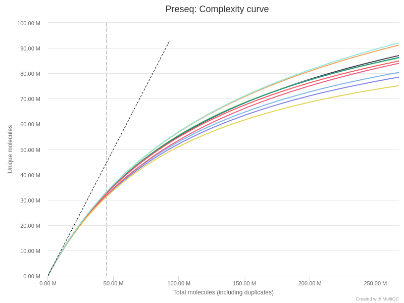
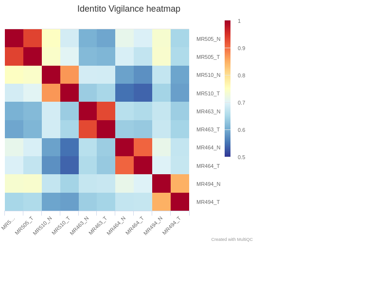

# Output

This document describes the output produced by the pipeline. Most of the plots are taken from the MultiQC report, which summarises results at the end of the pipeline.

## Pipeline overview
The pipeline is built using [Nextflow](https://www.nextflow.io/)
and processes whole-exome sequencing (WES), or whole-genome sequencing (WGS) data following the steps presented in the main README file.

Briefly, the workflow runs several quality controls from the raw and aligned data in order to validate both frozen and FFPE samples.
Then, several tools can be run in order to detect germline single nucleotide variants (SNVs) with [`haplotypecaller`](https://gatk.broadinstitute.org/hc/en-us/articles/360037225632-HaplotypeCaller), somatic SNVs with [`mutect2`](https://gatk.broadinstitute.org/hc/en-us/articles/360037593851-Mutect2), structural variants (SVs) with [`MANTA`](https://github.com/Illumina/manta) or copy number variants (CNV) with [`ASCAT`](https://www.crick.ac.uk/research/labs/peter-van-loo/software) and [`FACETS`](https://github.com/mskcc/facets).

The directories listed below will be created in the output directory after the pipeline has finished. 

## FastQC
[FastQC](http://www.bioinformatics.babraham.ac.uk/projects/fastqc/) gives general quality metrics about your reads. It provides information about the quality score distribution across your reads, the per base sequence content (%T/A/G/C). You get information about adapter contamination and other overrepresented sequences.

For further reading and documentation see the [FastQC help](http://www.bioinformatics.babraham.ac.uk/projects/fastqc/Help/).

> **NB:** The FastQC plots displayed in the MultiQC report shows the input reads. In theory, they should be already trimmed for adapter sequence and potentially regions with low quality. 
For details about reads trimming, see the `raw_qc` pipeline.

**Output directory: `preprocessing/metrics/fastqc`**

* `sample_fastqc.html`
  * FastQC report, containing quality metrics for your untrimmed raw fastq files
* `zips/sample_fastqc.zip`
  * zip file containing the FastQC report, tab-delimited data file and plot images

## Preprocessing

### Alignment

Raw reads are aligned on the reference genome with `BWA-mem`. The mapping statistics (`Total Reads`, `Aligned Reads`, `High-Quality Alignment`, `Low-Quality Alignment`) are also presented in the main summary table.  
Note that if multiple sequencing lanes from the same samples (same sampleID, sampleName) are specified, the bam files are merged just after `BWA-mem`.

**Output directory: `preprocessing/bams/bwa/`**

* `sample.bam`
  * Aligned reads
* `sample.bam.bai`
  * Index of aligned reads

The mapping statistics are presented in the MultiQC report as follows.  
In general, we expect more than 80% of aligned reads. Samples with less than 50% of mapped reads should be further investigated, and check for adapter content, contamination, etc.

  >**NB:** Note that by default, these mapping files are not saved. Use `--saveAlignedIntermediates` to save them.
  
  

### Duplicates

[Sambamba](https://lomereiter.github.io/sambamba/) is used to mark the duplicates. 
The results are presented in the `General Metrics` table.

**Output directory: `preprocessing/bams/markDuplicates`** 

* `sample.md.bam`
  * Aligned reads marked for duplicates
* `stats/sample.md.flagstats`
  * Number of alignments for each FLAG type
  
  >**NB:** Note that by default, these mapping files are not saved. Use `--saveAlignedIntermediates` to save them.

### Reads on target

In the context of WES analysis, the aligned reads are intersected with their targets, defined with the `--targetBED` parameter.
The percentage of reads on targets are presented in the `General Metrics` table.

**Output directory: `preprocessing/bams/onTarget`** 

* `sample.onTarget.bam`
  * Aligned reads restricted to the genomic targets.
* `stats/sample.onTarget.flagstat`
  * Number of alignments for each FLAG type
  
  >**NB:** Note that by default, these mapping files are not saved. Use `--saveAlignedIntermediates` to save them.

### Filtering

Aligned reads are then filtered-out in order to remove non informative reads for the downstream analysis.  
Importantly, `VEGAN` allows to precisely defined the filtering strategy for both SNV/CNV analysis (`--SNVFilters`) **and** for SV analysis (`--SVFilters`).

The aligned reads can be filtered out as follow :
- `mapq` : discard reads aligned with a mapping quality lower than `--mapQual`
- `duplicates` : discard reads flagged as duplicates
- `singleton` : discard reads for which the paired mate is not aligned
- `multihits` : discard reads aligned several times on the genome

By default the SNVFilters is defined to remove low mapq and dupicated reads, while the SVFilters only remove duplicated reads.  
The fraction of remaining reads after filtering is also presented in the `General Metrics` table.

**Output directory: `preprocessing/bams/filtering/`**

* `sample.filtered.[SNV/SV].bam`
  * Aligned and filtered reads
* `sample.filtered.[SNV/SV].bam.bai`
  * Index files
* `sample.filtered.[SNV/SV].idxstats`
  * Alignment summary statistics
* `sample.filtered.[SNV/SV].flagstats`
  * Number of alignments for each FLAG type

## Quality controls

From the filtered and aligned reads files, the pipeline then runs several quality control steps presented below.

### Sequencing complexity

The [Preseq](http://smithlabresearch.org/software/preseq/) package is aimed at predicting and estimating the complexity of a genomic sequencing library, equivalent to predicting and estimating the number of redundant reads from a given sequencing depth and how many will be expected from additional sequencing using an initial sequencing experiment. The estimates can then be used to examine the utility of further sequencing, optimize the sequencing depth, or to screen multiple libraries to avoid low complexity samples. The dashed line shows a perfectly complex library where total reads = unique reads. Note that these are predictive numbers only, not absolute. The MultiQC plot can sometimes give extreme sequencing depth on the X axis - click and drag from the left side of the plot to zoom in on more realistic numbers.

**Output directory: `preprocessing/metrics/preseq`**

* `sample_ccurve.txt`
  * Preseq expected future yield file.
  
  
  
### Fragment length

The fragment length is calculated from paired-end reads as the distance between the two mates with [`picard`](https://gatk.broadinstitute.org/hc/en-us/articles/360037055772-CollectInsertSizeMetrics-Picard-). The mean value is presented in the `General Metrics` table and the distribution is presented by MultiQC as follow :

**Output directory: `preprocessing/metrics/fragSize`**

* `sample_insert_size_metrics.txt`
  * Fragment size values reported by `picard`
* `sample_insert_size_hist.pdf`
  * Graphical representation

  

### Sequencing depth

The mean sequencing depth and the percentage of the genome (or targets) covered at soem threshold (X) are calculated with [`mosdepth`](https://github.com/brentp/mosdepth).  
The coverage at 30X, 50X (hidden column) and 100X are available in the `General Metrics` table.

   

In addition, the same analysis is repeated for exonic regions only. In the context of WES analysis, only the exonic regions overlapping with the targets are used.  
The results are presented in the 'Genes Coverage' section of the MultiQC report.

  

**Output directory: `preprocessing/metrics/depth`** 

* `*global*` files are the `mosdepth` outputs for stantard coverage on the genome
* `*regions*` files are the `mosdepth` outputs for the gene coverage

### WGS metrics

The [`picard collectWgsMetrics`](https://gatk.broadinstitute.org/hc/en-us/articles/360037430251-CollectWgsMetrics-Picard-) tool is run to collect some additional statistics on reads mapping.
Among them, the fraction of bases covered by both R1 and R2 mates are available in the `General Metrics` table.  
In the case of FFPE samples for which the fragment size is usually smaller, this metric can help adjusting the sequencing length. In addition, overlapping read pairs can sometimes be an issue for downstream analysis, and a reads trimming (or merge) can be an interesting option.

### Identity monitoring

In order to check the association between pairs of normal/tumor samples, a list of common SNPs (`--polym`) is used to cluster all the samples.  
The results are displayed as a heatmap with a color code representing the distance (1 - Jaccard) between two samples.

**Output directory: `preprocessing/metrics/identito`** 

* `sample.matrix.tsv`
  * results of the SNPs calling for the list of SNPs
* `clustering_plot_identito.csv`
  * distance matrix between each sample

  

## MultiQC

[MultiQC](http://multiqc.info) is a visualisation tool that generates a single HTML report summarising all samples in your project. Most of the pipeline QC results are visualised in the report and further statistics are available in within the report data directory.

The pipeline has special steps which allow the software versions used to be reported in the MultiQC output for future traceability.

**Output directory: `results/multiqc`**

* `Project_multiqc_report.html`
  * MultiQC report - a standalone HTML file that can be viewed in your web browser
* `Project_multiqc_data/`
  * Directory containing parsed statistics from the different tools used in the pipeline

For more information about how to use MultiQC reports, see http://multiqc.info.
See the file 'test/multiqc_report.html' for an example on the test dataset.
