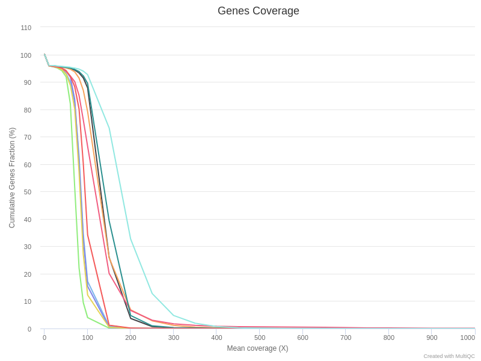

# Output

This document describes the output produced by the pipeline. Most of the plots are taken from the MultiQC report, which summarises results at the end of the pipeline.

## Pipeline overview
The pipeline is built using [Nextflow](https://www.nextflow.io/)
and processes whole-exome sequencing (WES), or whole-genome sequencing (WGS) data following the steps presented in the main README file.

Briefly, the workflow runs several quality controls from the raw and aligned data in order to validate both frozen and FFPE samples.
Then, several tools can be run in order to detect germline single nucleotide variants (SNVs) with [`haplotypecaller`](https://gatk.broadinstitute.org/hc/en-us/articles/360037225632-HaplotypeCaller), somatic SNVs with [`mutect2`](https://gatk.broadinstitute.org/hc/en-us/articles/360037593851-Mutect2), structural variants (SVs) with [`MANTA`](https://github.com/Illumina/manta) or copy number variants (CNV) with [`ASCAT`](https://www.crick.ac.uk/research/labs/peter-van-loo/software) and [`FACETS`](https://github.com/mskcc/facets).

The directories listed below will be created in the output directory after the pipeline has finished. 

## FastQC
[FastQC](http://www.bioinformatics.babraham.ac.uk/projects/fastqc/) gives general quality metrics about your reads. It provides information about the quality score distribution across your reads, the per base sequence content (%T/A/G/C). You get information about adapter contamination and other overrepresented sequences.

For further reading and documentation see the [FastQC help](http://www.bioinformatics.babraham.ac.uk/projects/fastqc/Help/).

> **NB:** The FastQC plots displayed in the MultiQC report shows the input reads. In theory, they should be already trimmed for adapter sequence and potentially regions with low quality. 
For details about reads trimming, see the `raw_qc` pipeline.

**Output directory: `preprocessing/metrics/fastqc`**

* `[SAMPLE]_fastqc.html`
  * FastQC report, containing quality metrics for your untrimmed raw fastq files
* `zips/[SAMPLE]_fastqc.zip`
  * zip file containing the FastQC report, tab-delimited data file and plot images

## Preprocessing

### Alignment

Raw reads are aligned on the reference genome with `BWA-mem`. The mapping statistics (`Total Reads`, `Aligned Reads`, `High-Quality Alignment`, `Low-Quality Alignment`) are also presented in the main summary table.  
Note that if multiple sequencing lanes from the same samples (same sampleID, sampleName) are specified, the bam files are merged just after `BWA-mem`.

**Output directory: `preprocessing/bams/bwa/`**

* `[SAMPLE].bam` and `[SAMPLE].bam.bai`
  * Aligned reads with BAM index

The mapping statistics are presented in the MultiQC report as follows.  
In general, we expect more than 80% of aligned reads. Samples with less than 50% of mapped reads should be further investigated, and check for adapter content, contamination, etc.

  >**NB:** Note that by default, these mapping files are not saved. Use `--saveAlignedIntermediates` to save them.
  
  

### Duplicates

[Sambamba](https://lomereiter.github.io/sambamba/) is used to mark the duplicates. 
The results are presented in the `General Metrics` table.

**Output directory: `preprocessing/bams/markDuplicates`** 

* `[SAMPLE].md.bam`
  * Aligned reads marked for duplicates
* `stats/[SAMPLE].md.flagstats`
  * Number of alignments for each FLAG type
  
  >**NB:** Note that by default, these mapping files are not saved. Use `--saveAlignedIntermediates` to save them.

### Reads on target

In the context of WES analysis, the aligned reads are intersected with their targets, defined with the `--targetBED` parameter.
The percentage of reads on targets are presented in the `General Metrics` table.

**Output directory: `preprocessing/bams/onTarget`** 

* `[SAMPLE].onTarget.bam`
  * Aligned reads restricted to the genomic targets.
* `stats/[SAMPLE].onTarget.flagstat`
  * Number of alignments for each FLAG type
  
  >**NB:** Note that by default, these mapping files are not saved. Use `--saveAlignedIntermediates` to save them.

### Filtering

Aligned reads are then filtered-out in order to remove non informative reads for the downstream analysis.  
Importantly, `VEGAN` allows to precisely defined the filtering strategy for both SNV/CNV analysis (`--SNVFilters`) **and** for SV analysis (`--SVFilters`).

The aligned reads can be filtered out as follow :
- `mapq` : discard reads aligned with a mapping quality lower than `--mapQual`
- `duplicates` : discard reads flagged as duplicates
- `singleton` : discard reads for which the paired mate is not aligned
- `multihits` : discard reads aligned several times on the genome

By default the SNVFilters is defined to remove low mapq and dupicated reads, while the SVFilters only remove duplicated reads.  
The fraction of remaining reads after filtering is also presented in the `General Metrics` table.

**Output directory: `preprocessing/bams/filtering/`**

* `[SAMPLE].filtered.[SNV/SV].bam` and `[SAMPLE].filtered.[SNV/SV].bam.bai`
  * Aligned and filtered reads with BAM index
* `[SAMPLE].filtered.[SNV/SV].idxstats`
  * Alignment summary statistics
* `[SAMPLE].filtered.[SNV/SV].flagstats`
  * Number of alignments for each FLAG type

## Quality controls

From the filtered and aligned reads files, the pipeline then runs several quality control steps presented below.

### Sequencing complexity

The [Preseq](http://smithlabresearch.org/software/preseq/) package is aimed at predicting and estimating the complexity of a genomic sequencing library, equivalent to predicting and estimating the number of redundant reads from a given sequencing depth and how many will be expected from additional sequencing using an initial sequencing experiment. The estimates can then be used to examine the utility of further sequencing, optimize the sequencing depth, or to screen multiple libraries to avoid low complexity samples. The dashed line shows a perfectly complex library where total reads = unique reads. Note that these are predictive numbers only, not absolute. The MultiQC plot can sometimes give extreme sequencing depth on the X axis - click and drag from the left side of the plot to zoom in on more realistic numbers.

**Output directory: `preprocessing/metrics/preseq`**

* `[SAMPLE]_ccurve.txt`
  * Preseq expected future yield file.
  
  
  
### Fragment length

The fragment length is calculated from paired-end reads as the distance between the two mates with [`picard`](https://gatk.broadinstitute.org/hc/en-us/articles/360037055772-CollectInsertSizeMetrics-Picard-). The mean value is presented in the `General Metrics` table and the distribution is presented by MultiQC as follow :

**Output directory: `preprocessing/metrics/fragSize`**

* `[SAMPLE]_insert_size_metrics.txt`
  * Fragment size values reported by `picard`
* `[SAMPLE]_insert_size_hist.pdf`
  * Graphical representation

  

### Sequencing depth

The mean sequencing depth and the percentage of the genome (or targets) covered at soem threshold (X) are calculated with [`mosdepth`](https://github.com/brentp/mosdepth).  
The coverage at 30X, 50X (hidden column) and 100X are available in the `General Metrics` table.

   

In addition, the same analysis is repeated for exonic regions only. In the context of WES analysis, only the exonic regions overlapping with the targets are used.  
The results are presented in the 'Genes Coverage' section of the MultiQC report.

  

**Output directory: `preprocessing/metrics/depth`** 

* `*global*` files are the `mosdepth` outputs for stantard coverage on the genome
* `*regions*` files are the `mosdepth` outputs for the gene coverage

### WGS metrics

The [`picard collectWgsMetrics`](https://gatk.broadinstitute.org/hc/en-us/articles/360037430251-CollectWgsMetrics-Picard-) tool is run to collect some additional statistics on reads mapping.
Among them, the fraction of bases covered by both R1 and R2 mates are available in the `General Metrics` table.  
In the case of FFPE samples for which the fragment size is usually smaller, this metric can help adjusting the sequencing length. In addition, overlapping read pairs can sometimes be an issue for downstream analysis, and a reads trimming (or merge) can be an interesting option.

### Identity monitoring

In order to check the association between pairs of normal/tumor samples, a list of common SNPs (`--polym`) is used to cluster all the samples.  
The results are displayed as a heatmap with a color code representing the distance (1 - Jaccard) between two samples.

**Output directory: `preprocessing/metrics/identito`** 

* `[SAMPLE].matrix.tsv`
  * results of the SNPs calling for the list of SNPs
* `clustering_plot_identito.csv`
  * distance matrix between each sample

  

## SNVs calling

### GATK Preprocessing

The current workflow follows the GATK good practices with [base recalibration](https://gatk.broadinstitute.org/hc/en-us/articles/360035890531-Base-Quality-Score-Recalibration-BQSR-).  
This step is usally recommanded to detects systematic errors in the data, but can be skipped with the option `--skipBQSR`.  
These files are used as inputs of all germline and somatic SNVs calling.

**Output directory: `preprocessing/bams/bqsr`**

* `[SAMPLE].recal.bam` and `[SAMPLE].recal.bam.bai`
  * Aligned data after base recalibration with BAM index

### Germline variants

Germline variants are then called using [`haplotypecaller`](https://gatk.broadinstitute.org/hc/en-us/articles/360037225632-HaplotypeCaller) following good practices (HaplotypeCaller, GenotypeGVCFs).
The number of detected variants are presented as a table in the MultiQC report.  
Note that by default the `gvcf` files are not stored unless the option `--saveGVCF` is used.

**Output directory: `HaplotypeCaller`**

* `[SAMPLE]_HaplotypeCaller.vcf.gz` and `[SAMPLE]_HaplotypeCaller.vcf.gz.tbi`
  * vcf file with the variants detected by HaplotypeCaller with Tabix index

### Somatic mutations

The somatic mutations calling requires pairs of normal/tumor samples defined in the `design` file.  
The [`mutect2`](https://gatk.broadinstitute.org/hc/en-us/articles/360037593851-Mutect2) tool is used to call somatic variants following the GATK good practices (Mutect2, MergeMutectStats, GetPileupSummaries, GatherPileupSummaries, CalculateContamination, FilterMutectCall).

**Output directory: `Mutect2`** 

* `[TUMORSAMPLE]_vs_[NORMALSAMPLE]_Mutect2_unfiltered.vcf.gz` and `[TUMORSAMPLE]_vs_[NORMALSAMPLE]_Mutect2_unfiltered.vcf.gz.tbi`
  * Mutect2 somatic variants before filtering with Tabix index
* `[TUMORSAMPLE]_vs_[NORMALSAMPLE]_Mutect2_filtered.vcf.gz` and `[TUMORSAMPLE]_vs_[NORMALSAMPLE]_Mutect2_filtered.vcf.gz.tbi`
  * Mutect2 somatic variants after filtering with Tabix index

### Transition/Transversion

For each filtered vcf files, the current workflow calculate the number of transition (A>G,T>C,C>T,G>A), transversions (A>C,T>G,C>A,G>T,A>T,T>A,C>G,G>C) and short insertions/delations (indels).
The results are available as table and presented in MultiQC.

**Output directory: `HaplotypeCaller/transition`** 

* `[SAMPLE]_filtered.vcf.Mutect2.table.tsv`
  * Number of bases substitution and indels for each type

**Output directory: `Mutect2/transition`**

* `[TUMORSAMPLE]_vs_[NORMALSAMPLE]_filtered.vcf.Mutect2.table.tsv`
  * Number of bases substitution and indels for each type
  

  

### Variants annotation

Each filtered VCF file is then annotated using [`snpeff`](https://pcingola.github.io/SnpEff/).
All annotated vcf files are saved and the following summary metrics are displayed in MultiQC.

**Output directory: `HaplotypeCaller/snpEff`**

* `[SAMPLE]_HaplotypeCaller_snpeff.ann.vcf.gz`
  * HaplotypeCaller annotated variants
  
**Output directory: `Mutect2/snpEff`**

* `[TUMORSAMPLE]_vs_[NORMALSAMPLE]_Mutect2_filtered_snpeff.ann.vcf.gz`
  * Mutect2 filtered and annotated somatic variants

 

 

## CNVs calling

CNVs calling can be run using [`ASCAT`](https://www.crick.ac.uk/research/labs/peter-van-loo/software) and [`FACETS`](https://github.com/mskcc/facets).
Both tools require pairs of tumor/normal samples.
ASCAT and Facets are two software for performing allele-specific copy number analysis of tumor samples and for estimating tumor ploidy and purity (normal contamination). They infer tumor purity and ploidy and calculates allele-specific copy number profiles. Both tools provide several images and tables as output.

**Output directory: `Facets`**

* `[TUMORSAMPLE]_subclonal_allele_spe_cnv_[CELLULARITY]cellularity_[PLOIDY]ploidy.txt`
  * Facets main table results
* `[TUMORSAMPLE]_subclonal_allele_spe_cnv_[CELLULARITY]cellularity_[PLOIDY]ploidy.pdf`
  * CNVs plot

**Output directory: `ASCAT`**

* `[TUMORSAMPLE].BAF` and `[NORMALSAMPLE].BAF`
  * file with beta allele frequencies generated by AlleleCount
* `[TUMORSAMPLE].LogR` and `[NORMALSAMPLE].LogR`
  * file with total copy number on a logarithmic scale generated by AlleleCount
* `[TUMORSAMPLE].ASCATprofile.png`
  * Image with information about ASCAT profile
* `[TUMORSAMPLE].ASPCF.png`
  * Image with information about ASPCF
* `[TUMORSAMPLE].rawprofile.png`
  * Image with information about raw profile
* `[TUMORSAMPLE].sunrise.png`
  * Image with information about sunrise
* `[TUMORSAMPLE].tumour.png`
  * Image with information about tumor
* `[TUMORSAMPLE].cnvs.txt`
  * file with information about CNVS
* `[TUMORSAMPLE].LogR.PCFed.txt`
  * file with information about LogR
* `[TUMORSAMPLE].BAF.PCFed.txt`
  * file with information about BAF	
* `[TUMORSAMPLE].purityploidy.txt`
  * file with information about purity ploidy

The text file `[TUMORSAMPLE].cnvs.txt` countains predictions about copy number state for all the segments.
The output is a tab delimited text file with the following columns:
 - *chr*: chromosome number
 - *startpos*: start position of the segment
 - *endpos*: end position of the segment
 - *nMajor*: number of copies of one of the allels (for example the chromosome inherited from the father)
 - *nMinor*: number of copies of the other allele (for example the chromosome inherited of the mother)

## SVs calling

Structural variants and indels are called using [`MANTA`](https://github.com/Illumina/manta) with or without matched control.
It is optimized for analysis of germline variation in small sets of individuals and somatic variation in tumor/normal sample pairs.

For all samples :

**Output directory: `Manta`**
  * `Manta_[SAMPLE].candidateSmallIndels.vcf.gz` and `Manta_[SAMPLE].candidateSmallIndels.vcf.gz.tbi`
    * `VCF` with Tabix index
  * `Manta_[SAMPLE].candidateSV.vcf.gz` and `Manta_[SAMPLE].candidateSV.vcf.gz.tbi`
    * `VCF` with Tabix index

For Normal sample only:

* `Manta_[NORMALSAMPLE].diploidSV.vcf.gz` and `Manta_[NORMALSAMPLE].diploidSV.vcf.gz.tbi`
  * VCF with Tabix index

For a Tumor sample only:

* `Manta_[TUMORSAMPLE].tumorSV.vcf.gz` and `Manta_[TUMORSAMPLE].tumorSV.vcf.gz.tbi`
  * VCF with Tabix index

For Tumor/Normal pair :

**Output directory: `Manta`**
  * `Manta_[TUMORSAMPLE]_vs_[NORMALSAMPLE].candidateSmallIndels.vcf.gz` and `Manta_[TUMORSAMPLE]_vs_[NORMALSAMPLE].candidateSmallIndels.vcf.gz.tbi`
    * `VCF` with Tabix index
  * `Manta_[TUMORSAMPLE]_vs_[NORMALSAMPLE].candidateSV.vcf.gz` and `Manta_[TUMORSAMPLE]_vs_[NORMALSAMPLE].candidateSV.vcf.gz.tbi`
    * `VCF` with Tabix index
  * `Manta_[TUMORSAMPLE]_vs_[NORMALSAMPLE].diploidSV.vcf.gz` and `Manta_[TUMORSAMPLE]_vs_[NORMALSAMPLE].diploidSV.vcf.gz.tbi`
    * `VCF` with Tabix index
  * `Manta_[TUMORSAMPLE]_vs_[NORMALSAMPLE].somaticSV.vcf.gz` and `Manta_[TUMORSAMPLE]_vs_[NORMALSAMPLE].somaticSV.vcf.gz.tbi`
    * `VCF` with Tabix index

## MultiQC

[MultiQC](http://multiqc.info) is a visualisation tool that generates a single HTML report summarising all samples in your project. Most of the pipeline QC results are visualised in the report and further statistics are available in within the report data directory.

The pipeline has special steps which allow the software versions used to be reported in the MultiQC output for future traceability.

**Output directory: `results/multiqc`**

* `Project_multiqc_report.html`
  * MultiQC report - a standalone HTML file that can be viewed in your web browser
* `Project_multiqc_data/`
  * Directory containing parsed statistics from the different tools used in the pipeline

For more information about how to use MultiQC reports, see http://multiqc.info.
See the file 'test/multiqc_report.html' for an example on the test dataset.
