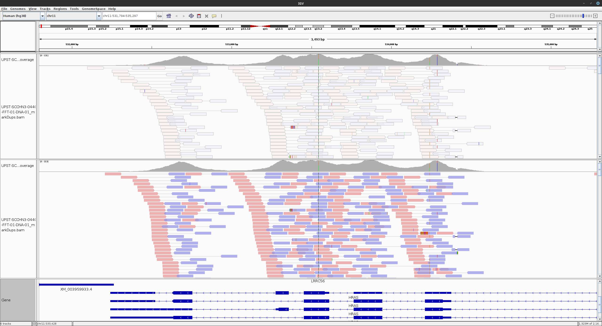

# Troubleshooting

## Tumor-only mode

### CNVs with `Facets`

`Facets` requires a normal to be run. However, the normal can be unmatch.  
In this case, the easier would be to start from bam files, with a design file specifying 
unmatch pairs, and to run VEGAN with the option `--facetsOpts '--unmatch --hetThres 0.1'`  
In this mode, heterogygous SNPs are called using tumor reads only and logOR calculations are different.
That's why it is recommanded to descrease the minimal VAF value to call a SNP heterozygous (`--hetThres`)

### Running `MSIsensor-pro`

To run on a single tumor, MSIsensor-pro requires to build a baseline from a panel of normal samples.
To do so, you have to specify a list of BAM files to use as baseline, by creating a configuration file as follow:

```
case1   /path/to/normal/case1_sorted.bam
case2   /path/to/normal/case2_sorted.bam
case3   /path/to/normal/case3_sorted.bam
```

The index file (.bai) should be in the same folder than the BAM files.  
You can then specify the config file using the `--msiBaselineConfig` parameter.  
According to the [MSIsensor-pro manual](https://github.com/xjtu-omics/msisensor-pro/wiki/Best-Practices), at least 20 normal samples
are recommanded.

```
nextflow run main.nf \
  --samplePlan sample_plan.csv \
  --design design.csv \
  --targetBed SureSelectXT_HS_Human_All_Exon_V8+NCV_hg38.bed \
  --genome 'hg38' \
  --aligner 'bwa-mem2' \
  --tools 'msisensor' \
  --msiBaselineConfig msiBaselineConfig.txt \
  -profile cluster,singularity \
  --containers.specificBinds '/data/'
```

Of note if you are using `singularity`, do not forget to bind the specific folder containings the BAM files you want to use as baseline, 
otherwise `MSIsensor` will not be able to read them.


## Starting VEGAN from CRAM files

CRAM files will be automatically detected based on their extension. However, this format is dependant on the reference genome used for the alignment.
Thus, the `fasta` and `fastaFai` information should be carrefully checked and modified accordingly, using either command line options or a dedicated configuration file.


## Alt-aware mode for the mapping

Since VEGAN 2.4.0, the bwa-mem mapping runs in alt-aware mode by default, avoiding multimapped reads in regions of the primary assembly with high similarities on their alternative contig (chr**_****_alt).
Before this version, reads mapped in regions annotated in both primary chromosomes and alternative contigsthat have been filtered due to the MAPQ=20 quality threshold.  
This could lead to the loss of some somatic variants on several cancer genes including HRAS, AKT3, NOTCH4, SMARCB1, etc.  
** For this reason, it is highly recommended to use the hg38 alt-aware mode for mapping.**

However, for compatibility reason, it is also possible to disable this mode by adding the parameter `-j` in the bwa-mem parameters `--bwaOpts`.


